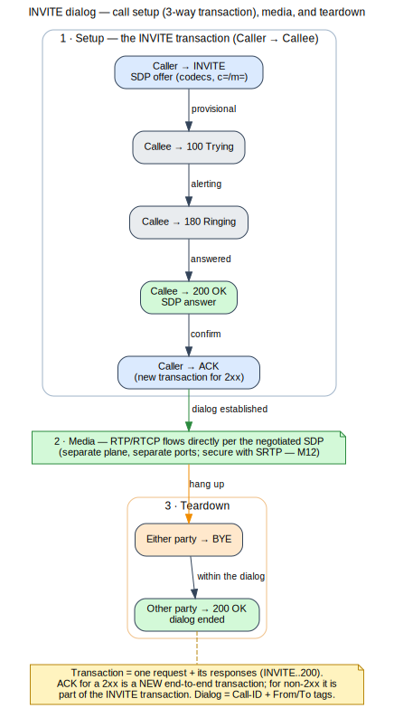
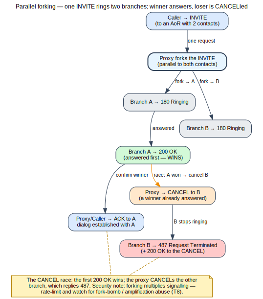

# Module 2 — Core SIP Protocol Deep Dive

**One-liner:** Read and reason about every part of a SIP transaction and dialog.
**Est. time:** 5h · **Prereqs:** Module 1.

## Learning Objectives
- Parse SIP requests/responses: methods, status codes, headers, bodies.
- Explain transactions vs. dialogs, Via/branch, Route/Record-Route, and Contact handling.
- Trace registration, proxying (stateful/stateless), redirect, forking, and B2BUA behavior.

## 1. Concept
- **Messages:** request line, status line; the SIP grammar; compact headers.
- **Methods:** REGISTER, INVITE, ACK, BYE, CANCEL, OPTIONS, INFO, PRACK, UPDATE, SUBSCRIBE,
  NOTIFY, MESSAGE, REFER, PUBLISH.
- **Responses:** 1xx–6xx classes; key codes (100,180,183,200,401,403,404,407,408,486,487,488,
  491,503,603) and their operational meaning.
- **Headers (mandatory + common):** Via (branch magic cookie), From/To (+tags), Call-ID, CSeq,
  Max-Forwards, Contact, Route/Record-Route, Expires, Allow/Supported/Require, Authorization/
  WWW-Authenticate, P-Asserted-Identity, Diversion/History-Info.
- **Transactions vs. dialogs:** client/server transactions, the 3-way INVITE transaction, ACK
  handling for 2xx vs. non-2xx; dialog identifiers (Call-ID + tags).

> Flow above (self-generated — [source](../references/diagrams/sip-invite-dialog.dot)): the 3-way
> INVITE transaction (INVITE/100/180/200/ACK), media on a separate plane, and BYE teardown. Note the
> 2xx ACK is a new end-to-end transaction. See the [diagram registry](../references/diagrams.md).

- **Routing:** Via processing, loose vs. strict routing, Record-Route, service-route.
- **Registration & mobility:** binding lifecycle, re-registration, forking (parallel/sequential),
  call forwarding (busy/no-answer/voicemail), Replaces, Diversion, History-Info.

> Flow above (self-generated — [source](../references/diagrams/sip-forking-cancel.dot)): one INVITE
> forks to two contacts; the first 200 OK wins and the proxy CANCELs the loser, which replies 487.
> See the [diagram registry](../references/diagrams.md).
- **Proxy modes & state:** stateless vs. stateful proxy, redirect (3xx), B2BUA (why it exists,
  what it hides/breaks).
- **SDP preview:** where the body lives (offer/answer handled fully in Module 3).

## 2. Packet Reality
- Line-by-line read of a real INVITE and 200 OK; follow Via/branch to correlate the transaction.
- Registration trace with 401 challenge → authenticated REGISTER.
- Forking trace (two 180s, one 200, CANCEL to the loser).
- Tools: `sngrep` ladder, Wireshark "Follow SIP", HOMER call correlation.

## 3. Build (OSS)
- Asterisk PJSIP dialplan for call forward + voicemail; observe generated headers.
- Kamailio as a **stateless** then **stateful** proxy for the same call; compare Via handling.
- Redirect scenario (3xx) via Kamailio `sl`/`tm`.

## 4. Attack / Defend
- **Header trust:** From/PAI are not authenticated by default → spoofing (T7). Which headers a
  proxy should rewrite/strip at the edge (topology hiding preview for M7/M8).
- **CSeq/Call-ID/tag** manipulation and replay considerations; Max-Forwards loops.
- **Registration hijack (T3):** why an unauthenticated REGISTER is fatal; challenge everything.
- Defense: authenticate REGISTER/INVITE, strip internal Via/Record-Route at edge, sane
  Max-Forwards, reject malformed (M15 fuzzing preview).

## 5. Labs
- **Lab 2.1:** Given three pcaps, identify each transaction/dialog and explain every non-2xx.
- **Lab 2.2:** Force and read a 401 challenge; annotate the auth round-trip.
- **Lab 2.3:** Configure sequential + parallel forking; capture and explain the CANCEL race.
- **Lab 2.4 (defense):** In Kamailio, strip internal `Via`/`Record-Route` on egress; prove
  topology hiding in a capture.
- *Rubric:* accurate transaction/dialog decomposition; correct auth trace; working forking;
  verified header stripping.

## Assessment (sample)
- Why is ACK handled inside the INVITE transaction for non-2xx but as a new transaction for 2xx?
- What is the branch magic cookie and what does it guarantee?
- Which two headers most enable caller-ID spoofing, and why doesn't the base protocol stop it?

## References
- RFC 3261 (full), 3262 (PRACK), 3263, 3265/6665 (events), 3515 (REFER), 3891 (Replaces),
  3323/3325 (privacy/PAI), 5806 (Diversion), 4244/7044 (History-Info).
