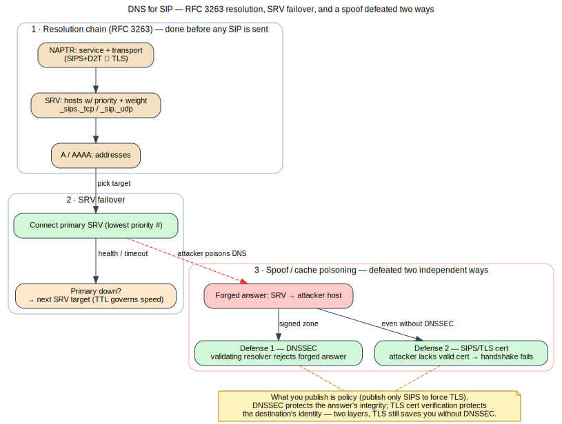

# Module 10 — DNS Infrastructure & Resilience for VoIP

**One-liner:** DNS is how SIP finds servers and survives failure — and a prime target for
redirecting calls. Build it correctly and defend it. **Est. time:** 4h ·
**Prereqs:** M9 (trunking), M1 (RFC 3263 intro). *Inserted alongside M9; not a renumber.*

> Added from reviewer feedback (`course/reviews/feedback-dns-module.md`). Positioned after M9
> because SIP server location, trunk failover, and service resilience all hinge on DNS.

## Learning Objectives
- Explain SIP server location per **RFC 3263**: NAPTR → SRV → A/AAAA, and how transport is chosen.
- Design DNS-based **failover and load distribution** with SRV priority/weight and sane TTLs.
- Use **anycast** for resilient, DDoS-tolerant SIP/edge frontends, and know its limits for stateful media.
- Run **cut-overs and rollbacks** safely with TTL strategy and health-checked record changes.
- Treat DNS as an **attack surface**: spoofing/cache poisoning → call redirection, and the
  defenses (DNSSEC, and authenticating the server by TLS cert regardless of DNS).

> Flow above (self-generated — [source](../references/diagrams/sip-dns-resolution.dot)): NAPTR→SRV→A
> resolution, SRV-priority failover, and a spoofed answer defeated independently by DNSSEC (answer
> integrity) and by SIPS/TLS cert verification (destination identity). See the [diagram registry](../references/diagrams.md).

## 1. Concept
- **Resolution chain (RFC 3263):** domain → NAPTR (service+transport, e.g. `SIPS+D2T`, `SIP+D2U`)
  → SRV (`_sips._tcp`, `_sip._udp`) with priority/weight → A/AAAA. Client picks transport from
  what's offered — so *what you publish is policy* (publish only `SIPS+D2T` to force TLS).
- **Records:** NAPTR (RFC 3401–3404), SRV (RFC 2782: priority = failover order, weight = load
  share), A/AAAA. TTL = how long a stale/old target lingers after a change.
- **Failover models:** multiple SRV targets (priority tiers) for client-side failover; GeoDNS /
  weighted answers for distribution; health-checked DNS for automated withdrawal of dead nodes.
- **Anycast:** same IP announced from many sites via BGP; the network routes to the nearest.
  Great for stateless UDP frontends and DDoS absorption; **stateful media (RTP) needs care** —
  a route flap can move a flow to a node without its session state (ties to M7 HA state sharing).
- **Cut-overs/rollbacks:** lower TTL *before* a change (e.g. 300s → 30s), make the change,
  verify, then raise TTL; keep the old target warm until TTL fully expires so rollback is instant.

## 2. Packet Reality
- `dig NAPTR lab.voipsec.test`, `dig SRV _sip._udp.lab.voipsec.test`, `dig +dnssec` — read the
  resolution a UAC performs before it ever sends a packet.
- Capture a client resolving and then registering; kill the primary SRV target and watch the
  client fail over to the secondary. Observe the TTL's effect on how fast a change takes.

## 3. Build (OSS)
- **BIND9** (or dnsmasq) authoritative zone for `lab.voipsec.test`: NAPTR + `_sip._udp` /
  `_sips._tcp` SRV records pointing at `edge-sbc`, with a second lower-priority SRV target.
- Configure **DNSSEC** signing of the zone; validate with `dig +dnssec`.
- Point Kamailio/Asterisk at the resolver and enable DNS **SRV failover** (Kamailio
  `use_dns_failover`, `dns_srv_lb`; Asterisk PJSIP `aor`/`endpoint` DNS).
- (Stretch) simulate anycast with two resolver instances sharing an address on the lab bridge.

## 4. Attack / Defend
- **DNS spoofing / cache poisoning (T6/T7):** a forged answer points `_sips._tcp` SRV at an
  attacker host → signaling redirected, calls intercepted or dropped.
- **Defenses:**
  - **DNSSEC** to authenticate records end-to-end; validating resolvers reject forged answers.
  - **Authenticate the server, not the name path:** with SIPS/TLS (M11) the client verifies the
    server certificate, so a DNS redirect to an attacker without the valid cert fails the TLS
    handshake — DNS integrity and transport identity are defense-in-depth.
  - **DoT/DoH** for resolver privacy/integrity; split-horizon DNS so internal SRV data never
    leaks to the edge; monitor for unexpected NXDOMAIN/answer changes.
  - Anycast to blunt DNS DDoS; rate-limit and RRL on authoritative servers.

## 5. Labs
- **Lab 10.1:** Author the NAPTR/SRV/A zone in BIND9; prove a client resolves it (RFC 3263 order)
  and registers through the resolved `edge-sbc`.
- **Lab 10.2 (failover):** Give the SIP service two SRV targets; take the primary down and show
  client-side failover; measure recovery vs TTL.
- **Lab 10.3 (security):** Inject a spoofed DNS answer redirecting `_sips._tcp` to a rogue host;
  show the call is redirected over plain resolution, then show **DNSSEC validation** and **TLS
  cert verification** each defeat the redirect.
- **Lab 10.4 (ops):** Perform a TTL-based cut-over to a new edge node and a clean rollback; write
  the runbook (pre-lower TTL, verify, raise TTL, rollback path).
- *Rubric:* correct RFC 3263 resolution; working SRV failover; demonstrated spoof + DNSSEC/TLS
  mitigation; a safe, reversible cut-over runbook.

## Assessment (sample)
- In what order does a UAC use NAPTR, SRV, and A/AAAA, and how does that let you *force* TLS?
- Why does lowering TTL *before* a cut-over matter, and how does it enable instant rollback?
- A validating resolver plus SIPS/TLS defends a DNS redirect two different ways — name each and
  say which one still protects you if DNSSEC is not deployed.

## References
- RFC 3263 (locating SIP servers), RFC 2782 (SRV), RFC 3401–3404 (NAPTR/DDDS),
  RFC 4033–4035 (DNSSEC), RFC 7858 (DoT), RFC 8484 (DoH), RFC 6116 (ENUM, see M19);
  BIND9 ARM; Kamailio `dns` / `dns_srv_lb` docs; NIST SP 800-81 (Secure DNS Deployment).
