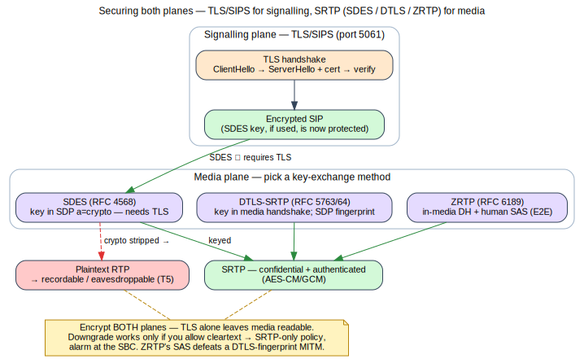

# Module 12 — Media Security: SRTP, DTLS-SRTP & ZRTP

**One-liner:** Encrypt the media plane and get the key exchange right — the difference between
"encrypted" and "actually private." **Est. time:** 5h · **Prereqs:** Module 11.

## Learning Objectives
- Configure SRTP with SDES, DTLS-SRTP, and ZRTP across the OSS stack.
- Explain the key-exchange trade-offs and their attack surfaces.
- Bridge secure/insecure media at the SBC without silently downgrading.

> Flow above (self-generated — [source](../references/diagrams/sip-media-crypto.dot)): TLS/SIPS secures
> signalling; media is keyed via SDES (needs TLS), DTLS-SRTP, or ZRTP (SAS) → SRTP. Stripping crypto
> downgrades to eavesdroppable plaintext RTP unless policy forbids it. See the [diagram registry](../references/diagrams.md).

## 1. Concept
- **Why encrypt media:** TLS protects signaling only; RTP is separately sniffable/recordable
  (M4 lab proved it). SRTP (RFC 3711) adds confidentiality + authentication to RTP/RTCP.
- **Key-exchange methods:**
  - **SDES (RFC 4568):** keys in SDP `a=crypto` — *only as safe as the signaling*; requires
    TLS/SIPS or keys leak. Simple, widely supported.
  - **DTLS-SRTP (RFC 5763/5764):** DTLS handshake in the media path; SDP carries
    `a=fingerprint`/`a=setup`; the WebRTC default; keys never in signaling.
  - **ZRTP (RFC 6189):** in-media Diffie-Hellman with SAS verification; end-to-end even across
    untrusted servers; MITM-resistant via short authentication string.
- **SRTP profiles/ciphers:** AES-CM + HMAC-SHA1, AES-GCM (AEAD); crypto-suite negotiation.
- **SBC media security bridging:** rtpengine as SRTP↔RTP / DTLS↔SDES gateway; the risk of a
  security *downgrade* at the border and how to make policy explicit.
- **Recording & lawful intercept vs. E2E crypto:** operational tension; where keys live.

## 2. Packet Reality
- Capture SDES-SRTP: note `a=crypto` (and why TLS must wrap it); show RTP is now unreadable.
- Capture DTLS-SRTP: observe the DTLS handshake + `a=fingerprint`; no keys in SDP.
- Capture ZRTP: observe Hello/Commit/DH and the SAS.

## 3. Build (OSS)
- Asterisk: `media_encryption=sdes` then `dtls` on a PJSIP endpoint; certs/fingerprints for DTLS.
- rtpengine flags to bridge `SRTP<->RTP` and `DTLS<->SDES`; enforce SRTP-only policy.
- ZRTP with Linphone/Baresip end-to-end; verify the SAS between two humans.

## 4. Attack / Defend
- **Eavesdropping (T5):** re-run the M4 audio-reconstruction attack against SRTP and show failure.
- **Downgrade attacks:** stripping `a=crypto`/`fingerprint` to force cleartext → policy: require
  encryption, reject non-secure media, alarm on downgrade at the SBC.
- **SDES-over-plaintext-signaling:** demonstrate key capture when SDES runs without TLS → always
  pair SDES with SIPS.
- **DTLS fingerprint substitution / MITM without SAS:** why ZRTP's SAS matters; cert/fingerprint
  binding to signaling identity.
- Finalize the crypto section of the hardening checklist; update threat model.

## 5. Labs
- **Lab 12.1:** Bring up SDES-SRTP (with TLS) end-to-end; prove media is unreadable in capture.
- **Lab 12.2:** Bring up DTLS-SRTP (WebRTC-style) via rtpengine; capture the handshake.
- **Lab 12.3 (attack):** Attempt an SDP `a=crypto` strip; show SRTP-only policy rejects the call;
  then demonstrate ZRTP SAS defeating an in-path MITM.
- *Rubric:* all three methods working; eavesdrop defeated; downgrade blocked; SAS verified.

## Assessment (sample)
- Why is SDES unsafe without TLS, and DTLS-SRTP not?
- What does the ZRTP SAS protect against that DTLS-SRTP alone may not?
- Where can a security downgrade occur in an SBC-mediated call, and how do you prevent it?

## Curriculum addition — WebRTC ↔ SIP secure media transcoding (review: gemini_feedback0)

WebRTC mandates encrypted media with a different keying model (DTLS-SRTP) and transport
quirks (ICE, RTP/RTCP mux) than legacy SIP. Bridging the two securely is a core SBC skill.
- **Standards:** DTLS-SRTP (RFC 5763/5764); ICE (RFC 8445); RTP/RTCP multiplexing (RFC 5761);
  WebRTC security & RTP usage (RFC 8826/8827/8834).
- **Build:** drive rtpengine with WebRTC bridging flags — `ICE=force`, `DTLS=passive`,
  `rtcp-mux-offer`, `SDES`/`RTP` on the legacy side — so a browser's DTLS-SRTP leg is
  translated to the PBX's SRTP or plain RTP leg without exposing cleartext on the wire.
- **Attack/Defend:** DTLS downgrade, fingerprint mismatch, ICE-based amplification; verify the
  media is never briefly unencrypted at the anchor (threats T5/T9).
- **Lab hook (adds B11+):** browser (DTLS-SRTP) ↔ Asterisk (SDES/RTP) call anchored by
  rtpengine; prove with capture that each leg is encrypted per its own scheme.

## References
- RFC 3711 (SRTP), 4568 (SDES), 5763/5764 (DTLS-SRTP), 6189 (ZRTP), 7714 (AES-GCM for SRTP);
  rtpengine README; Asterisk `media_encryption` docs; libsrtp docs.
