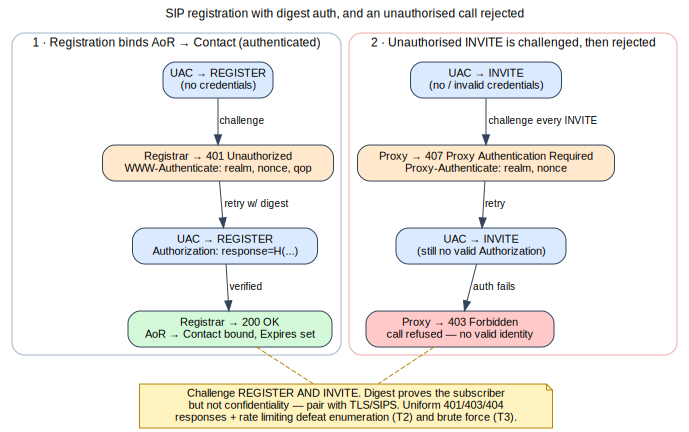
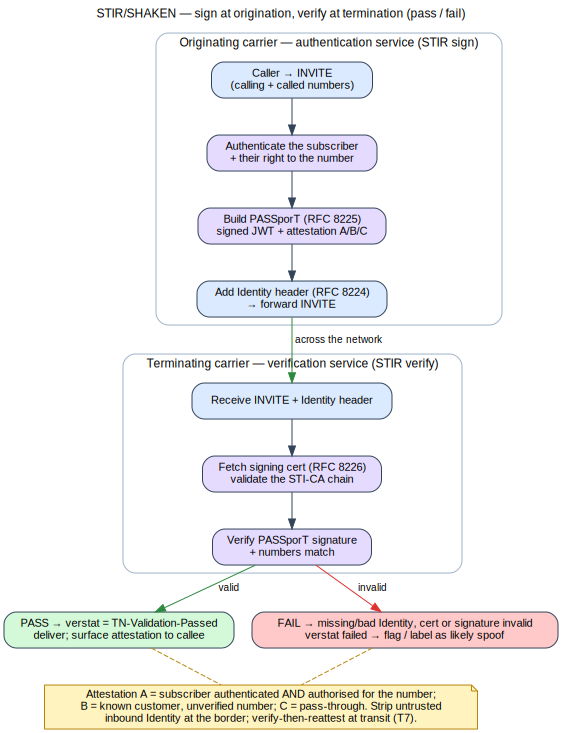

# Module 13 — Authentication, Authorization & Caller Identity

**One-liner:** Prove who a party is — at registration, at call setup, and across the PSTN with
STIR/SHAKEN. **Est. time:** 6h · **Prereqs:** Modules 6–11. **Checkpoint exam #2 after this module.**

## Learning Objectives
- Implement SIP digest authentication and authorization policy correctly.
- Deploy STIR/SHAKEN (sign + verify) with libstirshaken/Asterisk/OpenSIPS.
- Defend against enumeration, brute force, and caller-ID spoofing.

> Flow above (self-generated — [source](../references/diagrams/sip-registration-auth.dot)): the
> registrar challenges REGISTER (401) and binds the AoR only after a valid digest response; an
> unauthorised INVITE is challenged (407) and refused (403). See the [diagram registry](../references/diagrams.md).

## 1. Concept
- **SIP digest auth (RFC 7616/2617 heritage):** 401/407 challenge, realm, nonce, `qop`, MD5 vs.
  SHA-256 (RFC 8760), `Authorization`/`Proxy-Authorization`; where to challenge (REGISTER, INVITE).
- **Authorization policy:** what an authenticated identity is *allowed* to do — class-of-service,
  destination restrictions, time-of-day, concurrent-call caps; separating authN from authZ.
- **Caller identity in SIP:** From vs. P-Asserted-Identity (RFC 3325), P-Preferred, Privacy
  (RFC 3323), CNAM/eCNAM; why none of these are cryptographically trustworthy alone.
- **STIR/SHAKEN:**
  - The robocall/caller-ID-spoofing problem and its scale.
  - **STIR:** PASSporT (RFC 8225) — a signed JWT over calling/called numbers + attestation;
    `Identity` header (RFC 8224); certificates (RFC 8226) and the SPC/STI-CA trust chain.
  - **SHAKEN:** the deployment framework, attestation levels A/B/C, the authentication service
    (originating) and verification service (terminating), `verstat`.
  - Cert management, the "attestation gap" for enterprises, delegate certificates, Rich Call
    Data (RCD, RFC 9795/9796), out-of-band STIR, `div`/`div-o` for diverted calls (RFC 8946).
- **Interplay:** digest proves *your* subscriber; STIR/SHAKEN conveys trust *between operators*.

> Flow above (self-generated — [source](../references/diagrams/sip-stir-shaken.dot)): the originating
> authentication service signs a PASSporT (attestation A/B/C) into an Identity header; the terminating
> verification service validates the cert chain + signature, yielding a pass (`verstat` passed) or a
> fail (flagged as likely spoof). See the [diagram registry](../references/diagrams.md).

## 2. Packet Reality
- Read a 401/407 digest round-trip; identify realm/nonce/qop/response.
- Read a signed INVITE: decode the `Identity` header, the PASSporT header/payload/signature,
  and the attestation level; trace a verification success and a failure (missing/bad Identity).

## 3. Build (OSS)
- Enforce digest auth on REGISTER + INVITE in Asterisk and Kamailio (`auth`/`auth_db`); use SHA-256.
- STIR/SHAKEN: sign outbound with Asterisk `res_stir_shaken` (or OpenSIPS `stir_shaken`/
  libstirshaken); stand up a lab STI-CA; verify inbound and act on attestation/`verstat`.
- Authorization: dialplan/route policy mapping identity → allowed destinations + caps.

## 4. Attack / Defend
- **Extension enumeration (T2):** response/timing deltas (401 vs. 404 vs. 403) reveal valid users
  → uniform responses, randomized delay, fail2ban; don't leak in error bodies.
- **Registration/password brute force (T3):** svcrack → strong secret policy, lockout/backoff,
  IP allowlists for admin, TLS to protect credentials, monitor auth failures (M17).
- **Caller-ID spoofing (T7):** untrusted From/PAI → verify STIR/SHAKEN, gate features by
  attestation, feed analytics; never display unverified CNAM as trusted.
- **Weak digest (MD5, no qop):** upgrade to SHA-256/qop; TLS still required (digest ≠ confidentiality).
- Update threat model + hardening checklist (identity controls).

## 5. Labs
- **Lab 13.1:** Enforce SHA-256 digest on REGISTER+INVITE; capture and annotate the challenge.
- **Lab 13.2 (identity):** Sign outbound calls and verify inbound STIR/SHAKEN in the lab CA;
  decode a PASSporT; branch call handling on attestation level.
- **Lab 13.3 (attack→defend):** Run authorized `svwar`/`svcrack` against the lab; measure how
  uniform responses + fail2ban + lockout defeat enumeration and brute force.
- *Rubric:* strong digest enforced; working sign/verify with attestation logic; enumeration &
  brute force demonstrably mitigated.

## Assessment / Checkpoint Exam #2 (build + security)
- Why does digest authentication not provide confidentiality, and what must accompany it?
- Walk the PASSporT from creation to verification; what does attestation "A" assert?
- Give two response-handling changes that stop extension enumeration and explain why.

## Curriculum addition — Transit STIR/SHAKEN & digest interop (review: gemini_feedback0)

Identity assurance and authentication both break at the *seams* between networks and
algorithm generations — exactly where fraud and downgrade attacks live.

**Transit-carrier STIR/SHAKEN.**
- **Standards:** PASSporT (RFC 8225), Identity header (RFC 8224), certs (RFC 8226),
  SHAKEN PASSporT (RFC 8588), `div` PASSporT for diverted calls (RFC 8946); Out-of-Band
  STIR/SHAKEN (RFC 8816); ATIS-1000074.
- **Build/Policy:** model gateway/transit obligations — apply attestation **C** when you
  cannot verify the originator, strip untrusted inbound `Identity` headers, and use OOB
  SHAKEN to carry PASSporTs across TDM/SS7 hops that cannot pass the header inline.
- **Attack/Defend:** blindly trusting upstream attestation; enforce verify-then-reattest and
  header stripping at the border (threat T7).

**RFC 8760 digest hashing interop.**
- **Standards:** RFC 8760 (SHA-256/SHA-512-256 digest) alongside legacy MD5 (RFC 2617/3261).
- **Build:** issue a multi-`WWW-Authenticate` challenge (MD5 **and** SHA-256) for mixed fleets;
  configure the UAS to prefer the strongest offered and **reject algorithm downgrade**.
- **Lab hook (adds B12+):** (1) verify a spoofed inbound call has its attestation stripped and
  re-signed at "C"; (2) issue a dual-algorithm challenge and confirm a modern client selects
  SHA-256 while a downgrade attempt is refused.

## Curriculum addition — STIR/SHAKEN delegate certificates, RFC 9060 (review: gemini_feedback1)

Enterprises dialing out through a service provider that doesn't own their number block get
downgraded to attestation **B/C** — the "attestation gap." Delegate certificates close it.
- **Standards:** RFC 9060 (delegate certificates for STIR); RFC 8226 (cert framework,
  TNAuthList); RFC 8225/8224 (PASSporT/Identity).
- **Build:** the enterprise obtains a delegate certificate (SP/SPC-token → delegate CA) scoped
  to its telephone numbers, signs its own PASSporT, and presents it so the originating SP can
  verify and preserve **A-level** attestation.
- **Attack/Defend:** forged delegation / out-of-scope TNAuthList; verify the delegate cert
  chain and that signed numbers fall within the delegated range (threat T7).
- **Lab hook (adds BF11):** issue a delegate cert from the lab private CA, sign a PASSporT as
  the enterprise, and verify it at the SP side to retain attestation A.

## References
- RFC 7616 (HTTP digest), 8760 (SHA-256 for SIP), 3325/3323 (PAI/Privacy), 8224/8225/8226
  (STIR), 8588 (SHAKEN PASSporT), 8946 (div), 9795/9796 (Rich Call Data); ATIS-1000074/1000080 (SHAKEN);
  libstirshaken, Asterisk res_stir_shaken, OpenSIPS stir_shaken docs.
