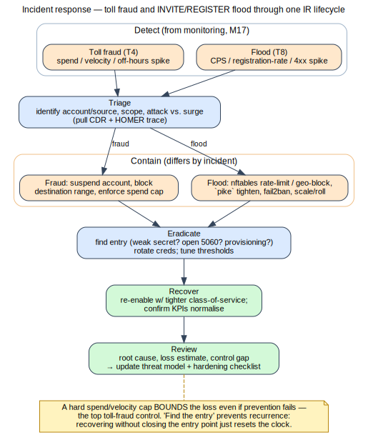

# Module 17 — Monitoring, Observability & Incident Response

**One-liner:** See everything, detect abuse in real time, and respond with runbooks.
**Est. time:** 5h · **Prereqs:** Modules 5, 13, 15.

## Learning Objectives
- Build a VoIP observability stack (metrics, logs, SIP capture) and meaningful dashboards/alerts.
- Detect the Module 15 attack signatures automatically.
- Execute incident-response runbooks for the top VoIP incidents.

## 1. Concept
- **Three pillars for VoIP:** metrics (Prometheus + exporters), logs (Loki/promtail, syslog),
  and full SIP capture/correlation (HOMER/HEP) — plus CDRs for toll-fraud detection (T4).
- **KPIs & SLOs:** registration success rate, ASR (answer-seizure ratio), ACD, PDD (post-dial
  delay), 4xx/5xx rates, concurrent calls, MOS/jitter/loss trends, trunk utilization.
- **Alerting:** thresholds vs. anomaly; alert on auth-failure spikes, scan patterns, flood, MOS
  drop, cert expiry, fraud indicators; Alertmanager routing; avoiding alert fatigue.
- **Detection engineering:** turn each M15 signature into a rule (Wazuh/Loki/HOMER queries):
  svmap sweeps, svwar enumeration, floods, spoofed/failed STIR verification, off-hours toll spikes.
- **Incident response for VoIP:** detect → triage → contain (suspend account, block source,
  reroute) → eradicate → recover → post-incident review; evidence handling from M5.
- **Forensics:** using HOMER captures + CDRs + logs to reconstruct an incident timeline.

> Flow above (self-generated — [source](../references/diagrams/sip-fraud-flood-ir.dot)): toll-fraud
> and flood both run the detect→triage→contain→eradicate→recover→review lifecycle, with
> incident-specific containment; a hard spend cap bounds fraud loss and "find the entry" prevents
> recurrence. See the [diagram registry](../references/diagrams.md).

## 2. Packet Reality
- Correlate a single fraudulent call across HOMER (signaling), CDR (billing), and logs (auth)
  to build an incident timeline.

## 3. Build (OSS)
- Prometheus + node/Asterisk/Kamailio exporters; Grafana dashboards for the KPIs above.
- Loki/promtail for structured SIP + auth logs; HOMER already capturing (M5).
- Wazuh rules + Alertmanager routes for the M15 signatures; test each alert fires.
- A CDR analytics job feeding fraud alerts (from M16) into the same alerting pipeline.

## 4. Attack / Defend
- Run the M15 assessment again "blind"; prove the SOC view detects each phase in real time.
- Tune out false positives; document detection coverage vs. the threat catalog (gap analysis).

## 5. Labs / Deliverable
- **Lab 17.1:** Build the KPI dashboard + alerts; screenshot healthy vs. under-attack states.
- **Lab 17.2:** Detection rules for all M15 signatures; show each firing during a replay.
- **Lab 17.3 (IR):** Author and execute an incident runbook for (a) toll fraud, (b) INVITE flood,
  (c) suspected eavesdropping; produce an incident report with a timeline.
- *Rubric:* actionable dashboards; complete detection coverage; runbooks executed with evidence.

## Assessment (sample)
- Which three KPIs best reveal an in-progress toll-fraud event, and why?
- Design an alert that catches svwar without firing on a busy call center.
- Outline the containment step for a compromised extension and its trade-offs.

## Curriculum addition — Recording access audit & compliance monitoring (review: gemini_feedback0)

The monitoring plane is where recording/CDR compliance is proven and where misuse is caught.
- **Build:** ship recording- and CDR-access events to the SIEM (Wazuh); alert on unauthorized
  or out-of-hours access to recordings, bulk exports, or retention-policy violations.
- **Attack/Defend:** insider access to recordings/CDRs (threat T14); maintain a tamper-evident
  audit trail and detection rules for anomalous access.
- **PCI/lawful-intercept:** log every access with actor + reason; verify DTMF-suppressed
  segments (built in M16) actually contain no card data before archival.
- **Lab hook (adds B15+):** add a Wazuh rule that fires on access to the recordings directory;
  trigger it and walk the alert → IR runbook path.

## Curriculum addition — Honeypot aggregation & active threat intel (review: gemini_feedback1)

The honeypot from M16 becomes an active-defense feed when its hits drive automated blocking
across the platform.
- **Build:** ship honeypot + SBC logs to Wazuh; a correlation rule turns a honeypot hit into a
  Wazuh **active-response** that updates the `nftables` IP set on every edge node; dashboard
  the scanner IPs and geo/ASN.
- **Attack/Defend:** ensure the feedback loop can't be abused for self-DoS (spoofed source →
  banning a legitimate IP); rate-limit and allowlist known-good before active-blocking.
- **Lab hook (adds BF12 cont.):** trigger a Wazuh active-response from a honeypot hit and
  verify the block propagates and expires per policy.
- **Lab hook (BF15 — Suricata IDS):** add a *signature* sensor beside the *behavioural* honeypot.
  Suricata watches the edge span for scanner UAs, OPTIONS/REGISTER/INVITE floods, and toll-fraud
  dial patterns; its EVE alerts feed the **same** nftables-ipset blocklist (`eve-to-ipset.sh`) and
  Wazuh correlation. Diverse detection, one response path — the M15→detect→M17 arc.

## References
- Prometheus/Grafana/Loki/Alertmanager docs; HOMER 7; Wazuh ruleset docs; NIST SP 800-61
  (incident handling); `../notes.md §2` threat catalog for detection mapping.
