# VoIP / SIP RFC Dependency Map

A curated map of how the core VoIP RFCs build on one another — the VoIP analogue of the
[RPKI RFC dependency graph](https://web.archive.org/web/20220724031723/http://rpki-rfc.routingsecurity.net/).
An arrow **A → B** reads "A extends or relies on B". This is a teaching map of the load-bearing
specs, not an exhaustive index; every RFC here is in the [bibliography](bibliography.md).

```mermaid
graph TD
  %% ---- Core signalling ----
  subgraph Signalling
    R3261["RFC 3261 — SIP (core)"]
    R3262["RFC 3262 — PRACK (100rel)"]
    R3311["RFC 3311 — UPDATE"]
    R3515["RFC 3515 — REFER"]
    R3265["RFC 3265 — Events"]
    R6665["RFC 6665 — Events (rev)"]
    R3325["RFC 3325 — P-Asserted-Identity"]
    R3323["RFC 3323 — Privacy"]
    R3264["RFC 3264 — Offer/Answer"]
  end
  R3262 --> R3261
  R3311 --> R3261
  R3515 --> R3261
  R3265 --> R3261
  R6665 --> R3265
  R3325 --> R3261
  R3323 --> R3261
  R3264 --> R3261

  %% ---- Media ----
  subgraph Media
    R4566["RFC 4566 — SDP"]
    R3550["RFC 3550 — RTP/RTCP"]
    R3711["RFC 3711 — SRTP"]
    R4568["RFC 4568 — SDES keying"]
    R5763["RFC 5763 — DTLS-SRTP framework"]
    R5764["RFC 5764 — DTLS-SRTP keying"]
    R6716["RFC 6716 — Opus codec"]
  end
  R3264 --> R4566
  R3711 --> R3550
  R4568 --> R4566
  R4568 --> R3711
  R5764 --> R3711
  R5763 --> R5764
  R4566 --> R6716

  %% ---- Signalling & identity security ----
  subgraph Identity_and_security
    R8224["RFC 8224 — STIR auth (Identity)"]
    R8225["RFC 8225 — PASSporT"]
    R8226["RFC 8226 — STIR certificates"]
    R8588["RFC 8588 — SHAKEN"]
    R9060["RFC 9060 — Delegate certs"]
    R8760["RFC 8760 — Digest SHA-256"]
  end
  R8224 --> R8225
  R8224 --> R3261
  R8588 --> R8224
  R8588 --> R8226
  R9060 --> R8226
  R8760 --> R3261

  %% ---- DNS / ENUM / PSTN / emergency ----
  subgraph Location_PSTN_Emergency
    R3263["RFC 3263 — Locating SIP servers"]
    R6116["RFC 6116 — ENUM"]
    R3398["RFC 3398 — ISUP↔SIP (Q.850)"]
    R4119["RFC 4119 — PIDF-LO location"]
    R6442["RFC 6442 — Location conveyance"]
    R6443["RFC 6443 — Emergency calling (SIP)"]
    R4412["RFC 4412 — Resource-Priority"]
    R5222["RFC 5222 — LoST (ECRF routing)"]
    R6881["RFC 6881 — BCP 181"]
    R7852["RFC 7852 — Additional data"]
  end
  R3261 --> R3263
  R6116 --> R3263
  R6442 --> R4119
  R6442 --> R3261
  R6443 --> R6442
  R6443 --> R4412
  R6443 --> R5222
  R6881 --> R6443
  R7852 --> R6443
```

## How to read it
- **RFC 3261 is the hub** — nearly everything extends the base SIP method/transaction/dialog model.
- **Media hangs off the offer/answer model** (3264 → SDP 4566), and **security wraps the media
  plane**: SRTP (3711) protects RTP (3550), keyed either in-band by SDES (4568, needs TLS) or by
  DTLS-SRTP (5763/5764).
- **Identity is its own tower**: SHAKEN (8588) stands on STIR auth (8224) + PASSporT (8225) +
  certificates (8226), with delegate certs (9060) extending the cert model.
- **Location/PSTN/emergency** reuse the same primitives — server location (3263), ISUP mapping
  (3398), and PIDF-LO (4119) conveyed by 6442 for emergency routing (6443) with priority (4412).

Teaching use: give learners one node and have them trace the path back to RFC 3261 — it shows why a
change (or a bug) in a base spec ripples through everything above it.
