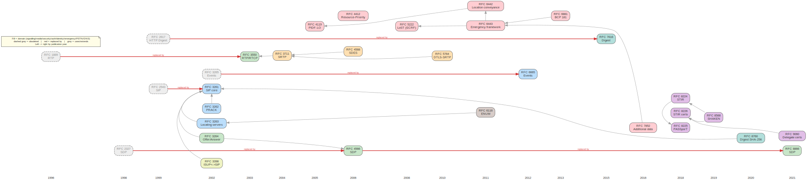

# VoIP / SIP RFC Evolution & Dependency Map

How the core VoIP RFCs build on one another **and how the course tracks superseded standards** — the
VoIP analogue of the [RPKI RFC dependency graph](https://web.archive.org/web/20220724031723/http://rpki-rfc.routingsecurity.net/).
Laid out **left-to-right by publication year**; every RFC here is in the [bibliography](bibliography.md).

> If the image doesn't render, open [`rfc-evolution-map.svg`](rfc-evolution-map.svg) directly.
> Source: [`rfc-evolution-map.dot`](rfc-evolution-map.dot) — rebuild with
> `dot -Tsvg rfc-evolution-map.dot -o rfc-evolution-map.svg`.

## Legend
- **Fill = domain:** signalling (blue), media (green), security (orange), auth (teal), identity
  (purple), emergency (red), PSTN (lime), DNS (brown).
- **Dashed grey node = obsoleted** RFC the course still tracks (e.g. RFC 2543→3261, 2327→4566→8866,
  1889→3550, 3265→6665, 2617→7616).
- **Red edge = "replaced by"** (the obsoletion spine, old → new). **Grey edge = "uses / extends".**

## How to read it
- **RFC 3261 is the hub** — nearly everything extends the base SIP model. RFC **2543** (1999) is its
  obsoleted ancestor; showing it teaches that today's SIP is a *revision*, not the first draft.
- **Media evolves too:** SDP **2327 → 4566 → 8866**, RTP **1889 → 3550** — a security course must
  know which version is current *and* what legacy gear may still speak.
- **Identity is the newest tower** (STIR/SHAKEN, 2018–2021); **emergency** (ECRIT: 4119/5222/6442/
  6443/6881/7852) and **auth** (digest 2617 → 7616, + 8760 SHA-256) show the same replace-and-extend
  pattern.

Teaching use: pick any current RFC and trace its red-edge lineage back in time — it shows why a lab
that only knows the newest spec still meets the old one on real networks.
